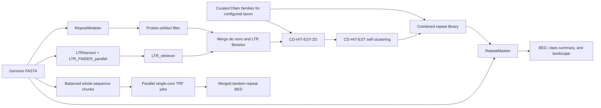

# TE_annotation

`TE_annotation` is a species-neutral Snakemake workflow for discovering,
classifying, merging, and annotating transposable elements (TEs) in a
eukaryotic genome. It combines de novo RepeatModeler families, structurally
discovered LTR retrotransposons, and curated Dfam families before running a
final RepeatMasker annotation.

The workflow is designed for SLURM clusters but can also be executed with any
Snakemake-compatible executor after adapting the resource configuration.

## Workflow



## Requirements

- Linux
- Snakemake 9
- Conda or Mamba
- Docker or Podman for the RepeatModeler container
- SLURM and the `cluster-generic` executor plugin for cluster execution
- A local [FamDB](https://github.com/Dfam-consortium/FamDB) installation and
  downloaded Dfam FamDB partitions
- A protein FASTA database, such as reviewed UniProt/Swiss-Prot proteins

The workflow-specific command-line tools are installed from the YAML files in
`workflow/envs/`. The RepeatModeler container is configurable and defaults to
the versioned `dfam/tetools:2.00` image.

## Installation

```bash
git clone https://github.com/rsbiello/TE_annotation.git
cd TE_annotation

conda env create --file environment.yaml
conda activate te-annotation-snakemake

cp config/config.example.yaml config/config.yaml
```

### Install FamDB and Dfam data

The workflow uses `famdb.py` to export curated Dfam consensus sequences for the
configured taxon. RepeatMasker includes a compatible copy of `famdb.py`, which
is the recommended version to use. If it is unavailable, download a release
from the [FamDB releases page](https://github.com/Dfam-consortium/FamDB/releases/latest).

The program and database are separate:

- `famdb_script` is the complete path to `famdb.py`.
- `famdb_dir` is the directory containing the downloaded Dfam `.h5` files.

Download the root file and the curated-consensus (`cc`) partitions needed for
your taxon from the [current Dfam FamDB release](https://www.dfam.org/releases/current/families/FamDB/).
The root file and all partition files must come from the same Dfam release and
must be placed together in one directory. Partition 0 is required; additional
partitions depend on the taxonomic lineage. Curated-consensus partitions are
sufficient for this workflow because it exports curated families in FASTA
format.

For example, an installation might be configured as:

```yaml
famdb_script: "/software/RepeatMasker/famdb.py"
famdb_dir: "/data/dfam/current/FamDB"
taxon: "Mammalia"
```

Check the installation and identify missing partitions before starting the
workflow:

```bash
FAMDB_SCRIPT=/software/RepeatMasker/famdb.py
FAMDB_DIR=/data/dfam/current/FamDB

python "$FAMDB_SCRIPT" -i "$FAMDB_DIR" info
python "$FAMDB_SCRIPT" -i "$FAMDB_DIR" names "Mammalia"
python "$FAMDB_SCRIPT" -i "$FAMDB_DIR" check "Mammalia"
```

Replace `Mammalia` with the species, clade, common name, or NCBI taxonomy ID
that will be used as `taxon`. The `check` command reports which locally missing
partition files are required for that query.

### Download the protein database

The `protein_db` input is a protein FASTA used by BLASTx to identify
RepeatModeler families that are more likely to be host-protein artifacts than
transposable elements. The recommended general-purpose database is the
reviewed, manually curated [UniProtKB/Swiss-Prot](https://www.uniprot.org/help/uniprotkb)
collection. The command below downloads the complete FASTA from UniProt's
EMBL-EBI mirror.

Download and decompress the current Swiss-Prot FASTA on the cluster or another
machine with sufficient storage:

```bash
PROTEIN_DB_DIR=/data/uniprot/swissprot
mkdir -p "$PROTEIN_DB_DIR"
cd "$PROTEIN_DB_DIR"

wget --continue \
  https://ftp.ebi.ac.uk/pub/databases/uniprot/knowledgebase/uniprot_sprot.fasta.gz

gzip -t uniprot_sprot.fasta.gz
gzip -dc uniprot_sprot.fasta.gz > uniprot_sprot.fasta
grep -c '^>' uniprot_sprot.fasta
```

Then configure the uncompressed file:

```yaml
protein_db: "/data/uniprot/swissprot/uniprot_sprot.fasta"
```

The workflow runs `makeblastdb` itself; do not provide prebuilt BLAST database
files. The mirror file changes when UniProt publishes a new release, so record
the download date and a checksum for reproducible analyses. A custom
protein FASTA may be used instead, but its taxonomic scope and annotation
quality will affect which candidate families are removed. Always inspect
`removed_artifacts.tsv` before accepting the filtered repeat library.

Edit `config/config.yaml`, especially:

- `genome`
- `species_name` and `database_name`
- `taxon`: any taxon available in the installed Dfam release, such as
  `Aves`, `Mammalia`, `Actinopterygii`, `Viridiplantae`, or a species name
- `famdb_script` and `famdb_dir`
- `protein_db`
- `rm_util_dir`
- partition names, resource limits, and wall times

RepeatModeler performs family classification itself. The workflow therefore
uses its `*-families.fa` output directly for protein-artifact filtering instead
of running RepeatClassifier a second time in a separate environment.

## LTR discovery modes

The default configuration enables RepeatModeler's integrated structural LTR
pipeline and disables the additional standalone LTR_retriever branch:

```yaml
repeatmodeler_ltr_struct: true
run_ltr_retriever: false
```

This is the recommended balance for routine multi-species annotation. Set
`run_ltr_retriever: true` when an additional independent search using
LTRharvest and LTR_FINDER_parallel is worth the extra runtime. Set
`repeatmodeler_ltr_struct: false` only when intentionally disabling the
integrated RepeatModeler LTR analysis.

The local `config/config.yaml` is ignored by Git so machine-specific paths are
not published accidentally.

## Parallel TRF execution

TRF itself is single-threaded. The workflow therefore uses a scatter–gather
stage:

1. Scan the FASTA and calculate each sequence length.
2. Assign complete sequence records to balanced chunks.
3. Run one single-core TRF job for every chunk.
4. Merge and sort the chunk BED files.

Sequence records are never divided, so no artificial sequence boundaries are
introduced and BED coordinates still refer directly to the original FASTA.
Set the number of jobs with:

```yaml
trf_chunks: 32
```

Use fewer chunks on small clusters. Use more chunks for highly fragmented
assemblies, up to the enforced maximum of 256. A chromosome remains intact;
therefore an unusually large or repeat-rich chromosome can still be the last
job to finish. Give each TRF chunk sufficient walltime while keeping
`resources.trf.threads: 1`.

The maximum number of jobs running simultaneously remains controlled by
Snakemake's `--jobs` setting and by SLURM resource availability.

## Validate before running

```bash
python -m unittest discover -s tests -v

snakemake \
  --snakefile workflow/Snakefile \
  --configfile config/config.yaml \
  --dry-run \
  --printshellcmds \
  --cores 1
```

To solve and build the Conda environments without starting the analysis:

```bash
snakemake \
  --snakefile workflow/Snakefile \
  --configfile config/config.yaml \
  --use-conda \
  --conda-prefix .snakemake/conda \
  --conda-create-envs-only \
  --cores 1
```

Strict Conda channel priority is recommended:

```bash
conda config --set channel_priority strict
```

## SLURM execution

Review `profiles/slurm/config.yaml` and adapt the `sbatch` command to the local
cluster. Create the log directory before submission:

```bash
mkdir -p logs/slurm
```

If running the Snakemake scheduler on a login node is permitted:

```bash
snakemake \
  --snakefile workflow/Snakefile \
  --configfile config/config.yaml \
  --profile profiles/slurm
```

Otherwise, submit the included controller job from an activated Snakemake
environment:

```bash
sbatch slurm/controller.sbatch
```

The profile uses `workflow/scripts/slurm_status.py` to query both `squeue` and
`sacct`. This allows Snakemake to distinguish successful jobs from failures,
timeouts, cancellations, and out-of-memory termination. It also configures
`scancel` so that Snakemake can cancel submitted jobs during shutdown.

Cluster-specific node restrictions should be added locally to the SLURM
profile. They are deliberately not hardcoded in the public workflow.

## Main outputs

All paths are relative to `output_dir`.

| Output | Description |
|---|---|
| `01_repeatmodeler/*-families.fa` | RepeatModeler family library |
| `01b_classified_filtered/*.filtered.fa` | Classified families after the protein-hit heuristic |
| `01b_classified_filtered/removed_artifacts.tsv` | Families removed by that heuristic |
| `02b_ltr_retriever/LTRlib.fa` | Nonredundant structural LTR library |
| `02_library/*combined*.fa` | Final curated plus de novo library |
| `03_repeatmasker_final/*.fa.masked` | Soft-masked genome |
| `03_repeatmasker_final/*.fa.out` | RepeatMasker annotation table |
| `03_repeatmasker_final/*.fa.out.gff` | RepeatMasker GFF output |
| `04_postprocess/repeats.bed` | RepeatMasker calls converted to BED |
| `04_postprocess/te_summary_by_class.tsv` | Hit count and annotated bases by TE class |
| `04_postprocess/tandem_repeats.bed` | Optional merged tandem-repeat BED |
| `04_postprocess/trf/manifest.tsv` | TRF chunk sizes and sequence counts |
| `04_postprocess/repeat_landscape.html` | Optional Kimura-divergence landscape |

## Protein-artifact filtering

`workflow/scripts/filter_artifacts.py` applies a deliberately simple heuristic:

1. Retain families with no significant BLASTx hit.
2. Retain families whose best hit contains a recognized TE term.
3. Report and remove families whose best hit is a non-TE protein.

This is not a substitute for manual repeat-family curation. Inspect both the
filtered library and `removed_artifacts.tsv`, particularly when annotating a
lineage with poorly characterized proteins. The BLASTx threshold is set in the
Snakefile (`1e-10`).

## Restarting and troubleshooting

Snakemake retains valid completed outputs. After correcting a failed rule,
restart with `--rerun-incomplete`; do not delete completed RepeatModeler or
RepeatMasker outputs.

The new TRF scatter layout ignores `.dat` files left in the old
`04_postprocess/trf/` directory, but preserving a failed directory is useful
for diagnosis:

```bash
mv results/04_postprocess/trf results/04_postprocess/trf.failed.JOB_ID
```

Useful commands:

```bash
squeue -u "$USER"
sacct -j JOB_ID --format=JobID,State,ExitCode,Elapsed,MaxRSS,ReqMem
snakemake --snakefile workflow/Snakefile --configfile config/config.yaml --summary
```

## Tests

```bash
python -m unittest discover -s tests -v
snakemake \
  --snakefile workflow/Snakefile \
  --configfile tests/config.test.yaml \
  --dry-run --cores 1
```

GitHub Actions runs these checks on pushes and pull requests.

## Citation

If you use this workflow, cite the repository release as well as the tools used
in your selected branches, including Snakemake, RepeatModeler, RepeatMasker,
LTR_retriever, LTR_FINDER_parallel, GenomeTools/LTRharvest, CD-HIT, TRF, Dfam,
and UniProt where applicable. See `CITATION.cff` for repository metadata.

## License

The workflow code is released under the [MIT License](LICENSE). External tools,
containers, and databases retain their own licenses and terms.
