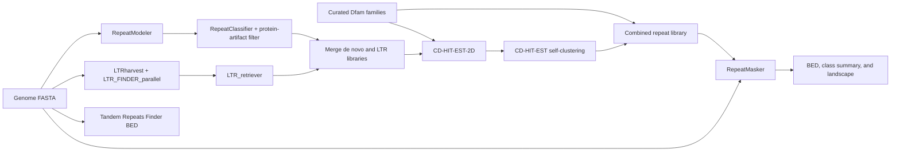

# TE_annotation

`TE_annotation` is a Snakemake workflow for discovering, classifying, merging,
and annotating transposable elements (TEs) in a eukaryotic genome. It combines
de novo RepeatModeler families, structurally discovered LTR retrotransposons,
and curated Dfam families before running a final RepeatMasker annotation.

The workflow is designed for SLURM clusters but can also be executed with any
Snakemake-compatible executor after adapting the resource configuration.

## Workflow



## Requirements

- Linux
- Snakemake 9
- Conda or Mamba
- Docker or Podman for the RepeatModeler container
- SLURM and the `cluster-generic` executor plugin for cluster execution
- A local [FamDB](https://github.com/Dfam-consortium/FamDB) installation and
  downloaded Dfam FamDB partitions
- A protein FASTA database, such as reviewed UniProt/Swiss-Prot proteins

The workflow-specific command-line tools are installed from the YAML files in
`workflow/envs/`. The RepeatModeler container is configurable and defaults to
the versioned `dfam/tetools:2.00` image.

## Installation

```bash
git clone https://github.com/YOUR_GITHUB_USERNAME/TE_annotation.git
cd TE_annotation

conda env create --file environment.yaml
conda activate te-annotation-snakemake

cp config/config.example.yaml config/config.yaml
```

Edit `config/config.yaml`, especially:

- `genome`
- `species_name`, `database_name`, and `taxon`
- `famdb_script` and `famdb_dir`
- `protein_db`
- `rm_util_dir`
- partition names, resource limits, and wall times

The local `config/config.yaml` is ignored by Git so machine-specific paths are
not published accidentally.

## Validate before running

```bash
snakemake \
  --snakefile workflow/Snakefile \
  --configfile config/config.yaml \
  --dry-run \
  --printshellcmds \
  --cores 1
```

To solve and build the Conda environments without starting the analysis:

```bash
snakemake \
  --snakefile workflow/Snakefile \
  --configfile config/config.yaml \
  --use-conda \
  --conda-prefix .snakemake/conda \
  --conda-create-envs-only \
  --cores 1
```

Strict Conda channel priority is recommended:

```bash
conda config --set channel_priority strict
```

## SLURM execution

Review `profiles/slurm/config.yaml` and adapt the `sbatch` command to the local
cluster. Create the log directory before submission:

```bash
mkdir -p logs/slurm
```

If running the Snakemake scheduler on a login node is permitted:

```bash
snakemake \
  --snakefile workflow/Snakefile \
  --configfile config/config.yaml \
  --profile profiles/slurm
```

Otherwise, submit the included controller job from an activated Snakemake
environment:

```bash
sbatch slurm/controller.sbatch
```

Cluster-specific node restrictions should be added locally to the SLURM
profile. They are deliberately not hardcoded in the public workflow.

## Main outputs

All paths are relative to `output_dir`.

| Output | Description |
|---|---|
| `01_repeatmodeler/*-families.fa` | RepeatModeler family library |
| `01b_classified_filtered/*.filtered.fa` | Classified families after the protein-hit heuristic |
| `01b_classified_filtered/removed_artifacts.tsv` | Families removed by that heuristic |
| `02b_ltr_retriever/LTRlib.fa` | Nonredundant structural LTR library |
| `02_library/*combined*.fa` | Final curated plus de novo library |
| `03_repeatmasker_final/*.fa.masked` | Soft-masked genome |
| `03_repeatmasker_final/*.fa.out` | RepeatMasker annotation table |
| `03_repeatmasker_final/*.fa.out.gff` | RepeatMasker GFF output |
| `04_postprocess/repeats.bed` | RepeatMasker calls converted to BED |
| `04_postprocess/te_summary_by_class.tsv` | Hit count and annotated bases by TE class |
| `04_postprocess/tandem_repeats.bed` | Optional tandem-repeat BED |
| `04_postprocess/repeat_landscape.html` | Optional Kimura-divergence landscape |

## Protein-artifact filtering

`workflow/scripts/filter_artifacts.py` applies a deliberately simple heuristic:

1. Retain families with no significant BLASTx hit.
2. Retain families whose best hit contains a recognized TE term.
3. Report and remove families whose best hit is a non-TE protein.

This is not a substitute for manual repeat-family curation. Inspect both the
filtered library and `removed_artifacts.tsv`, particularly when annotating a
lineage with poorly characterized proteins. The BLASTx threshold is set in the
Snakefile (`1e-10`).

## Restarting and troubleshooting

Snakemake retains valid completed outputs. After correcting a failed rule,
remove only that rule's incomplete output directory and restart with
`--rerun-incomplete`. SLURM rule logs are written to `logs/slurm/` by the
provided profile.

Useful commands:

```bash
squeue -u "$USER"
sacct -j JOB_ID --format=JobID,State,ExitCode,Elapsed,MaxRSS,ReqMem
snakemake --snakefile workflow/Snakefile --configfile config/config.yaml --summary
```

## Tests

```bash
python -m unittest discover -s tests -v
snakemake \
  --snakefile workflow/Snakefile \
  --configfile tests/config.test.yaml \
  --dry-run --cores 1
```

GitHub Actions runs these checks on pushes and pull requests.

## Citation

If you use this workflow, cite the repository release as well as the tools used
in your selected branches, including Snakemake, RepeatModeler, RepeatMasker,
LTR_retriever, LTR_FINDER_parallel, GenomeTools/LTRharvest, CD-HIT, TRF, Dfam,
and UniProt where applicable. See `CITATION.cff` for repository metadata.

## License

The workflow code is released under the [MIT License](LICENSE). External tools,
containers, and databases retain their own licenses and terms.
